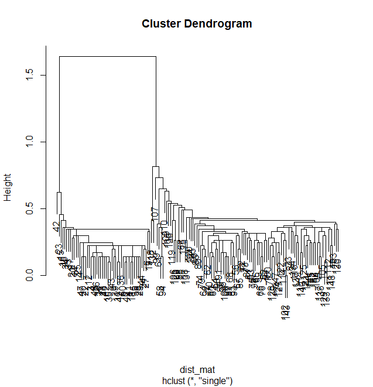
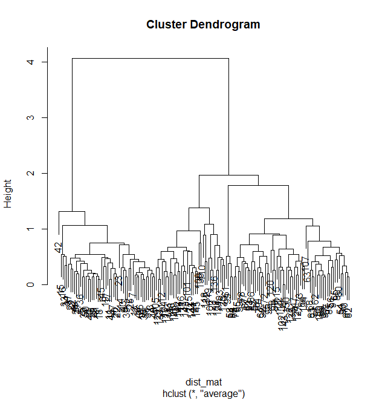
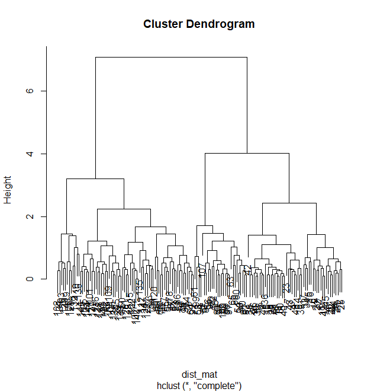
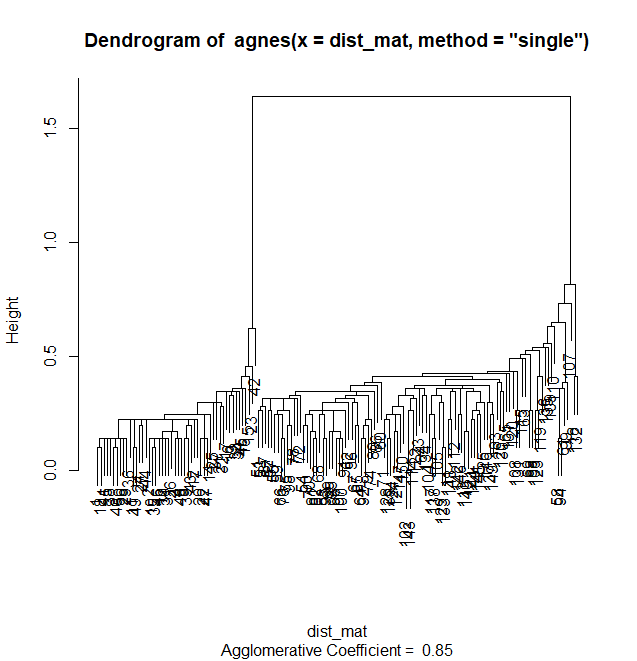

# Estadística Aplicada III - Tarea 1
#### David Emmanuel González Cázares
#### Marcelino Cabrera Jiménez

1. **Derive la probabilidad de mala clasificación para LDA**


2. **Implementar LDA sobre la base de datos ```MNIST``` y usar los dígitos 1 y 3**

La implementación en R fue usando la librería de ```MASS``` para el método de LDA, y la librería ```dslabs``` para acceder a los datos de MNIST

Se inicializan los datos de la siguiente forma:

```
mnist_data <- read_mnist()
```

Los datos ya vienen divididos en variables ```train``` y ```test```, las que a su vez contienen ```images``` y ```labels```.

Ahora, los datos de imágenes 28x28 vienen en forma de vectores de 784 entradas, con valores del 0 al 255 representando la gamma del gris. Debido a su fuerte correlación entre pixeles adyacentes, es importante reducir la colinearidad al tomar en vez un estadístico de los pixeles que nos ayude todavía a diferenciarlos. Para esto, decidimos tomar el promedio de los renglones de la imagen para determinar cuánto está dibujado de negro cada fila en la imagen; un dato que debe ayudarnos en general a distinguir 1s de 3s.

```
#Extraer el train y test
tri <- train_images <- mnist_data$train$images
train_labels<-mnist_data$train$labels
tei <- test_images <- mnist_data$test$images
test_labels <- mnist_data$test$labels

#Transformar el train al estadístico que deseamos de solo 1 y 3
tr_ind <- (train_labels == 1) | (train_labels==3)
train_labels <- train_labels[tr_ind]
tri <- tri[tr_ind,]
tri2 <- array(tri, dim=c(dim(tri)[1],28,28))
tri_promr <- rowMeans(tri2, dims = 2)

#Transformar el test al estadístico que deseamos de solo 1 y 3
te_ind <- (test_labels == 1) | (test_labels==3)
test_labels <- test_labels[te_ind]
tei <- tei[te_ind,]
tei2 <- array(tei, dim=c(dim(tei)[1],28,28))
tei_promr <- rowMeans(tei2, dims = 2)
```

Una vez hecho eso, ahora aplicamos el algoritmo de LDA para crear el predictor, construyendo la matriz (Y,X) para insertar al modelo.

```
train <- data.frame(label = (train_labels == 1),tri_promr)

model <- lda(label~.,data=train)
```

Una vez entrenado, ahora lo ponemos a prueba con el set de ```test```, y medimos la precisión.

```
test <- data.frame(label = (test_labels == 1),tei_promr)


prob <- predict(model, test, method = "debiased") #, type = "response")
pred <- ifelse(prob$posterior[,2] > 0.5, 1, 3)

sum(pred == test_labels) / length(test_labels) #precisión de predictor

```

Con ello, obtenemos al final los resultados del experimento, lo cual nos da:

```
> prob <- predict(model, test, method = "debiased") #, type = "response")
> pred <- ifelse(prob$posterior[,2] > 0.5, 1, 3)
> sum(pred == test_labels) / length(test_labels) #precisión de predictor
[1] 0.8899767
```

Eso nos da una precisión del 88.99%, bastante alto para un predictor lineal de clases entre 1 y 3. Con ello, se conluye el problema.

3. **Implementar QDA sobre la base de datos de ```iris```**

4. **Problema 8.3 Izenman**

Tenemos $X_1 \sim N_r(μ_1, Σ_{XX}), X_2 \sim N_r(μ_2, Σ_{XX})$ independientes, y tenemos el siguiente estadístico:

$$
G(a) =\frac{\{\mathbb{E}[a^TX_1] - \mathbb{E}[a^TX_2]\}^2}{Var(a^TX_1-a^TX_2)}
$$

Ahora, si consideramos $X_1 - X_2 \sim N_r(\mu_1-\mu_2, 2\Sigma_{XX}) =: N_r(\mu_Y,\Sigma_{YY})$, entonces:

$$
\max_{a \in \mathbb{R}^r} \frac{(a^T\mu_Y)^2}{a^T\Sigma_{YY}a}, \\ 
s.a. ~~~a^T\Sigma_{YY}a=1
$$

Para esto, empezamos derivando el multiplicador:

$$
F(a) = G(a)-a^T\Sigma_{YY}a
$$
$$
\implies \frac{\partial F(a)}{\partial a} = \frac{2a^T\mu_Y\mu_Y^T(a^T\Sigma_{YY}a)-2(a^T\mu_Y)^2a^T\Sigma_{YY}}{(a^T\Sigma_{YY}a)^2} - 2\lambda a^T\Sigma_{YY} =0
$$
$$
\implies 2a^T\mu_Y\mu_Y^T(a^T\Sigma_{YY}a)= 2\lambda a^T\Sigma_{YY}(a^T\Sigma_{YY}a)^2-2(a^T\mu_Y)^2a^T\Sigma_{YY}
$$
$$
\implies a^T\mu_Y\mu_Y^T=\lambda a^T\Sigma_{YY}-(a^T\mu_Y)^2a^T\Sigma_{YY} = (\lambda-(a^T\mu_Y)^2)a^T\Sigma_{YY}
$$
$$
\implies a^T((\lambda-(a^T\mu_Y)^2)\Sigma_{YY}-\mu_Y\mu_Y^T)=0
$$
Ahora, recordemos que una expresión equivalente a $F(a)$ es:
$$
F(a) = (a^T\mu_Y)^2-\lambda a^T\Sigma_{YY}a
$$
$$
\implies \partial_aF(a)=2(\mu_Y\mu_Y^T-\lambda\Sigma_{YY})a=0
$$
$$
\implies (\mu_Y\mu_Y^T-\lambda\Sigma_{YY})a=0
\\
\implies a(\mu_Y\mu_Y^T-\lambda\Sigma_{YY})a=0
\\
\implies (a^T\mu_Y)^2=\lambda
$$
$$
\therefore \sqrt{\lambda}\mu_Y-\lambda\Sigma_{YY}a=0
\\
\therefore a=\frac{1}{\sqrt{\lambda}}\Sigma_{YY}^{-1}\mu_Y~~ \alpha~~\Sigma_{XX}^{-1}(\mu_1-\mu_2)
$$
Con esto, concluímos el problema.

5. **Problema 11.4 Johnson and Wichern** A researcher wants to determine a procedure for discriminating between two multivariate populations. The reseacher has enough data available to estimate the density functions $f_1(x)$ and $f_2(x)$ associated with populations $\pi_1$ and $\pi_2$, respectively. Let $c(2|1)=50$ (this is the cost of assigning items as $\pi_2$, given $\pi_1$ as true), and $c(1|2)=100$. In addition, it is known that about 20% of all possible items (for which measurements $x$ can be recorded) belong to $\pi_2$.
    <ol type="a">
    <li>
    Give the minimum ECM rule (in general form) for assigning a new item one of the two populations.
    </li>
    <li>
    Measurements recorded on a new item yield the density values f_1(x)=.3 and f_1(x)=.5. Given the preceding information, assign this item to population Pi_1 or population Pi_2.
    </li>
    </ol>
Para el primer inciso, tenemos la fórmula del ECM:

$$
ECM = \Sigma_{i=1}^k\pi_i(\Sigma_{j\not=i}c(j,i)\mathbb{P}(j|i))
$$

El problema ya nos dice que $\pi_2$=0.2, al igual que nos da los valores de $c(1,2)$ y $c(2,1)$, por lo cual reescribimos:

$$
ECM = 0.8(50\mathbb{P}(2|1))+0.2(100\mathbb{P}(1|2))
\\
=40*\mathbb{P}(2|1)+20*\mathbb{P}(1|2)
$$

Para el segundo inciso, tenemos $f_1(x)=.3$ y $f_2(x)=.5$. Podemos estimar a cuál población se asigna el nuevo registro, usando el Teorema de Bayes:

$$
\mathbb{P}(1|X)=\frac{\mathbb{P}(X|1)\mathbb{P}(1)}{\mathbb{P}(X|1)\mathbb{P}(1)+\mathbb{P}(X|2)\mathbb{P}(2)}
\\
\mathbb{P}(2|X)=\frac{\mathbb{P}(X|2)\mathbb{P}(2)}{\mathbb{P}(X|1)\mathbb{P}(1)+\mathbb{P}(X|2)\mathbb{P}(2)}
$$

Recordando que $\mathbb{P}(1)=\pi_1$ y $\mathbb{P}(2)=\pi_2$, y que $\mathbb{P}(X|1)=f_1(x)$, $\mathbb{P}(X|2)=f_2(x)$, podemos calcular las probabilidades:

$$
\mathbb{P}(1|X)=\frac{0.3*0.8}{0.3*0.8 + 0.5*0.2}=\frac{24}{38}
\\
\mathbb{P}(2|X)=\frac{0.5*0.2}{0.3*0.8 + 0.5*0.2}=\frac{14}{38}
$$
Con esto podemos concluir que el nuestro objeto **tiene que clasificarse en $\Pi_1$.**


6. **Problema 11.16 Johnson and Wichern**
7. **Problema 12.2 Izenman**
8. **Implementar SL, AL y CL y divisive cluster para la base de datos de ```iris```. Interprete los resultados.**

Primero inicializamos ```iris``` y agarramos los datos numéricos de su base de datos
```
library(cluster)

#Iris DB
data <- as.matrix(iris[,1:4])
dist_mat <- dist(data, method = 'euclidean')
```
Luego, usamos clustering aglomerativo usando ```hclust``` y clustering divisivo usando ```agnes```, con ello corremos lo siguiente:

```
hclust_single <- hclust(dist_mat, method = 'single')
hclust_average <- hclust(dist_mat, method='average')
hclust_complete <- hclust(dist_mat, method= 'complete')
divisive_model <- agnes(dist_mat, method = "single")
```
Los plots resultantes son los siguientes:

 Single Linkage Agglomerative Cluster

 Average Linkage Agglomerative Cluster

 Complete Linkage Agglomerative Cluster

 Divisive Cluster

De estas imágenes podemos determinar, junto con el conocimiento previo de que hay **tres** tipos de plantas, que el Complete Linkage Cluster es el que mejor nos permite diferenciar los tipos de planta que tiene la base de datos al hacer un corte horizontal a altura 3.5, mientras que los demás algoritmos tienen problema diferenciando los tipos de especies al tomar diferencias mínimas o promedio de medidas en sépalo y pétalo. Por tanto, **es más fácil diferenciar las especies de plantas por el tamaño máximo de sépalo y pétalo de las plantas, haciendo el Complete Linkage el más efectivo.**

9. **Problema 12.13 Johnson and Wichern**
10. **Problema 12.14 Johnson and Wichern**